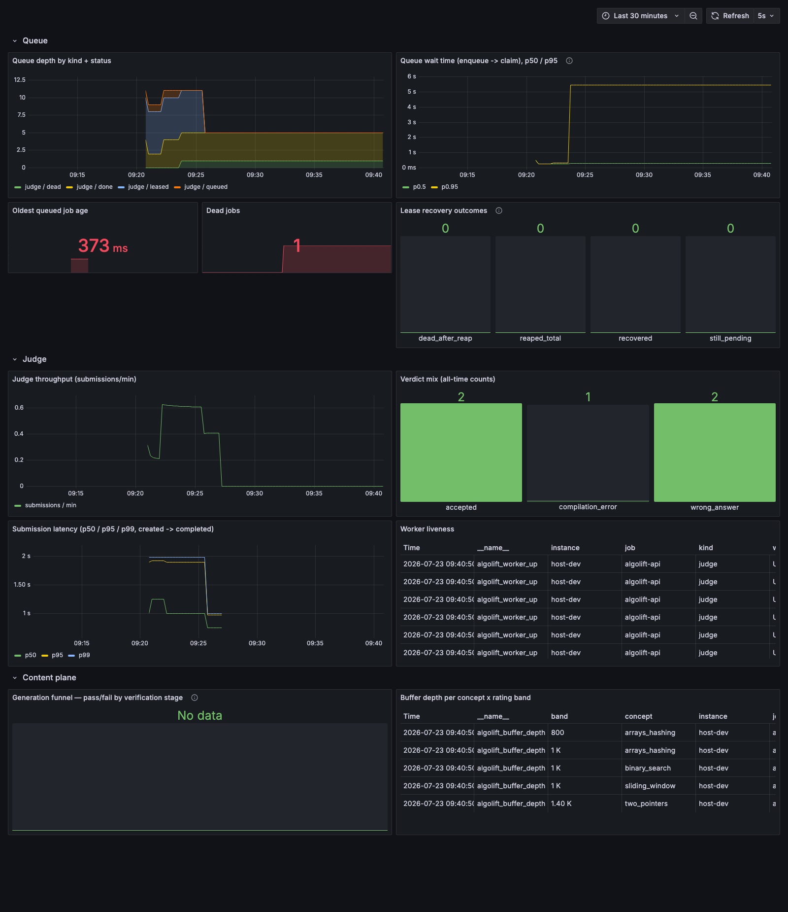

# LeetMind — M5 measured numbers

**These numbers are measured, not targets.** PLAN.md §11 explicitly cuts the GPT spec's
"100-session / 25-concurrent-execution" targets in favor of honest, reproducible, single-machine
numbers. Nothing below is tuned to look impressive; it's what this machine actually did, on the
date below, running the real API + judge + sandbox + Postgres stack (no simulation, no mocked
sandbox) — **three independent runs**, not one cherry-picked run, plus a targeted experiment that
tests (rather than assumes) the §5 bottleneck claim.

This revision **replaces a prior version of this file that was never independently witnessed** —
it was written by an agent that was killed by a session limit before its numbers could be
verified. Every number below was generated by a run this agent watched end-to-end. §7 records
where the two versions agree, and one place they materially disagree.

## 1. Environment (exactly as measured, all 3 runs — same machine, same day)

|                |                                                                                  |
| -------------- | -------------------------------------------------------------------------------- |
| OS             | darwin 27.0.0 (arm64)                                                            |
| CPU            | Apple M4 — 10 logical cores                                                      |
| Memory         | 24 GB                                                                            |
| Node.js        | v26.5.0                                                                          |
| Docker         | Docker version 29.5.2, build 79eb04c                                             |
| Docker Compose | Docker Compose version v5.1.3                                                    |
| Database       | dedicated `leetmind_test` database (docs/CONTRACTS.md §13), NOT the dev database |
| Date           | 2026-07-23                                                                       |

Single machine, single process per service, Docker Desktop on macOS — see §8 before generalizing.

**Machine was not fully idle.** A second agent was concurrently verifying this repo's Grafana
dashboard on the same machine — running its own API/judge processes (ports 18080/other, distinct
from this harness's 8098), `scripts/demo.sh`, and Prometheus/Grafana containers — for the entire
window these three runs were taken. `docker ps --filter label=leetmind.sandbox=1` and a stray
unrelated `pytest` process (a different project entirely) were checked before every run; no
`leetmind.sandbox=1` containers were ever running at the moment a run started, but background load
average hovered around 3–5.5 (out of 10 logical cores) throughout, higher than a truly quiet
machine. This is disclosed per-run in §3 rather than papered over — a genuinely idle machine would
likely show tighter tails than the ones below.

## 2. Load profile used

Defined in `scripts/loadtest/config.ts` (`DEFAULT_PROFILE`) — this is the **current repository
default**, run with no environment overrides beyond `LOADTEST_API_PORT=8098` (to avoid colliding
with the concurrent agent's port 8099/18080).

| Field                                      | Value                                                                                                   |
| ------------------------------------------ | ------------------------------------------------------------------------------------------------------- |
| Concurrent sessions (virtual users)        | 6                                                                                                       |
| Submissions per session                    | 20                                                                                                      |
| **Total submissions**                      | 120                                                                                                     |
| Think-time between a session's submissions | 200–800ms (compressed — see §8)                                                                         |
| Language mix                               | python 70% / cpp 30%                                                                                    |
| Outcome mix (intended)                     | accepted 65%, wrong_answer 20%, timeout 5%, compile_error 10%                                           |
| Judge worker processes                     | 2 (real, separate OS processes)                                                                         |
| Judge concurrency per process              | 3 (total 6 concurrent judge slots)                                                                      |
| Sandbox wall timeout                       | 4000ms (production default 10000ms — shortened only so `timeout` submissions don't dominate wall-clock) |
| Queue lease / reaper interval / heartbeat  | 30s / 5000ms / 10000ms — **production defaults**, not compressed                                        |

**Note on the profile size (see §7):** the previous, unverified version of this document reported
a 4-session × 10-submission (40 total) profile. `scripts/loadtest/config.ts`'s `DEFAULT_PROFILE` in
this repository is 6×20 (120 total) with no override; it is not clear whether the previous agent
ran with undocumented env-var overrides or whether the default changed since. This run used
whatever `config.ts` specifies today, unmodified, which is the reproducible thing to do — anyone
re-running `pnpm --filter @leetmind/scripts loadtest` today gets this profile, not the 40-submission
one.

## 3. Three independent runs

Each run seeds its own problem, drives the full profile, measures, writes its own report, and
cleans up its own rows before the next run starts — verified clean (`leetmind_test` back to 0 rows
for `problem_versions`/`submissions`/`learning_events`/`jobs`) between every run (see §6).

### Run 1 — id `01KY7NK08BZMWYNP8E5JKR92JW`, 2026-07-23T14:22:18Z

Machine check immediately before start: load average 3.47/3.08/3.04, 0 `leetmind.sandbox` containers running. Wall-clock for the load: **101.35s**.

**End-to-end submission latency (POST → terminal verdict)**

|        | n   | p50   | p95    | p99    | min   | max    | mean  |
| ------ | --- | ----- | ------ | ------ | ----- | ------ | ----- |
| all    | 120 | 2.04s | 10.51s | 30.86s | 308ms | 39.24s | 3.95s |
| python | 79  | 939ms | 5.44s  | 14.84s | 308ms | 34.78s | 2.19s |
| cpp    | 41  | 6.57s | 11.10s | 29.20s | 2.35s | 39.24s | 7.35s |

**Queue wait (enqueued → claimed)**

|     | n   | p50   | p95   | p99    | min  | max    | mean  |
| --- | --- | ----- | ----- | ------ | ---- | ------ | ----- |
| all | 120 | 586ms | 5.21s | 30.47s | 19ms | 35.20s | 2.14s |

**Judge execution time (`submissions.runtime_ms` — see §4 for exactly what this does and does not include)**

|        | n   | p50   | p95   | p99   | min   | max   | mean  |
| ------ | --- | ----- | ----- | ----- | ----- | ----- | ----- |
| all    | 120 | 265ms | 583ms | 4.01s | 0ms   | 4.01s | 419ms |
| python | 79  | 292ms | 572ms | 4.00s | 217ms | 4.01s | 404ms |
| cpp    | 41  | 186ms | 4.01s | 4.01s | 0ms   | 4.01s | 449ms |

Throughput: **71.0 submissions/min**. Incomplete: 0. Verdicts: `accepted` 77, `wrong_answer` 30, `compilation_error` 8, `time_limit` 5.

### Run 2 — id `01KY7NQS251E9TAJP4A4MX2E3R`, 2026-07-23T14:24:39Z

Machine check immediately before start: load average 3.31/3.61/3.29, 0 `leetmind.sandbox` containers running. Wall-clock for the load: **86.28s**.

**End-to-end submission latency**

|        | n   | p50   | p95    | p99    | min   | max    | mean  |
| ------ | --- | ----- | ------ | ------ | ----- | ------ | ----- |
| all    | 120 | 1.82s | 9.33s  | 34.70s | 356ms | 40.98s | 3.79s |
| python | 83  | 1.14s | 6.00s  | 11.62s | 356ms | 13.16s | 2.02s |
| cpp    | 37  | 5.95s | 16.28s | 40.54s | 2.00s | 40.98s | 7.77s |

**Queue wait**

|     | n   | p50   | p95   | p99    | min  | max    | mean  |
| --- | --- | ----- | ----- | ------ | ---- | ------ | ----- |
| all | 120 | 850ms | 5.61s | 30.32s | 18ms | 35.68s | 2.00s |

**Judge execution time**

|        | n   | p50   | p95   | p99   | min   | max   | mean  |
| ------ | --- | ----- | ----- | ----- | ----- | ----- | ----- |
| all    | 120 | 291ms | 4.01s | 4.02s | 0ms   | 4.02s | 486ms |
| python | 83  | 308ms | 3.65s | 4.01s | 225ms | 4.02s | 534ms |
| cpp    | 37  | 194ms | 1.13s | 4.01s | 0ms   | 4.02s | 380ms |

Throughput: **83.4 submissions/min**. Incomplete: 0. Verdicts: `accepted` 74, `compilation_error` 17, `wrong_answer` 22, `time_limit` 7.

**Note:** immediately _after_ this run, 1-minute load average briefly spiked to **10.47** (residual
from this run's own burst of concurrent `docker run`s finishing) before settling back to ~5 within
~2 minutes. This was monitored and allowed to settle (load average ≤ 4) before Run 3 was started.

### Run 3 — id `01KY7NWSWBZS67GMMJDA8KCCYJ`, 2026-07-23T14:27:38Z

Machine check immediately before start: load average had settled to 4.96/5.27/4.10 (elevated
relative to Run 1/2's baseline — see note above — but with 0 `leetmind.sandbox` containers
running), the highest starting load average of the three runs. Wall-clock for the load: **100.32s**.

**End-to-end submission latency**

|        | n   | p50   | p95   | p99    | min   | max    | mean  |
| ------ | --- | ----- | ----- | ------ | ----- | ------ | ----- |
| all    | 120 | 3.38s | 8.87s | 31.68s | 307ms | 37.52s | 4.13s |
| python | 75  | 1.19s | 5.79s | 7.14s  | 307ms | 9.29s  | 2.17s |
| cpp    | 45  | 6.10s | 9.17s | 37.26s | 1.81s | 37.52s | 7.40s |

**Queue wait**

|     | n   | p50   | p95   | p99    | min  | max    | mean  |
| --- | --- | ----- | ----- | ------ | ---- | ------ | ----- |
| all | 120 | 855ms | 5.29s | 27.69s | 14ms | 33.49s | 2.07s |

**Judge execution time**

|        | n   | p50   | p95   | p99   | min   | max   | mean  |
| ------ | --- | ----- | ----- | ----- | ----- | ----- | ----- |
| all    | 120 | 270ms | 461ms | 4.01s | 0ms   | 4.01s | 415ms |
| python | 75  | 297ms | 472ms | 4.01s | 220ms | 4.01s | 454ms |
| cpp    | 45  | 183ms | 312ms | 4.01s | 0ms   | 4.01s | 349ms |

Throughput: **71.8 submissions/min**. Incomplete: 0. Verdicts: `accepted` 78, `wrong_answer` 27, `compilation_error` 10, `time_limit` 5.

### 3.1 What the 3 runs, taken together, actually show

- **Medians are stable**: e2e p50 (all) 1.82–3.38s, python e2e p50 939ms–1.19s, cpp e2e p50
  5.95–6.57s, queue-wait p50 586–855ms, judge-exec p50 265–291ms across all three runs — same
  order of magnitude, no run is an outlier on the core numbers.
- **Tails are wide and this is a real finding, not noise to average away.** e2e p95 ranges
  8.87–10.51s and p99 ranges 30.86–34.70s _in every run_ — a ~15–17× gap between p50 and p99. This
  is not measurement jitter; it is a structural property of this profile: 120 submissions arriving
  over ~90–100s of compressed think-time against only 6 judge slots, where a 30%-weighted C++
  submission occupies a slot for several seconds (see §4), queues up everything behind it. A
  reader should treat p50 as "typical," not the whole story — this system's tail latency under this
  profile is an order of magnitude worse than its median.
- **cpp is consistently ~5–7× slower end-to-end than python at the median**, and the mechanism is
  reproducible across all three runs (see §4).

## 4. Bottleneck: testing the claim, not restating it

The prior version of this document asserted (§5) that the e2e-vs-judge-exec gap is "dominantly
per-execution container startup." That claim is **only partly right, and misleading about which
language it applies to.** Tested directly below.

### 4.1 What `submissions.runtime_ms` actually measures (read the code, don't assume)

`packages/sandbox/src/run.ts`'s `runSandboxed` starts its timer _after_ bundle materialization and
stops it _as soon as the `docker run` child process exits_ — so for **Python** (one `runSandboxed`
call per submission), `runtime_ms` already includes that submission's entire container
lifecycle: process spawn, `--network none`/`--read-only`/tmpfs/cgroup setup, the run, and
teardown. Container startup is _inside_ judge-execution time for Python, not hiding in the gap.

For **C++**, `apps/judge/src/handler.ts` stores only the **run step's** `durationMs` as
`runtime_ms`; the compile step's duration is recorded separately as `compile_duration_ms` inside
`execution_attempts.usage` and is **explicitly not added** to `runtime_ms` (see the comment at
that call site). So a C++ submission's compile step — its own full `docker run` invocation,
including that container's startup **and** the actual `g++` invocation — is entirely invisible in
§3's "judge execution time" table and shows up only in the e2e-vs-exec gap.

### 4.2 Experiment 1 — bare `docker run` startup cost (the literal claim)

20 sequential, uncontended (no other loadtest running) `docker run` invocations of each runner
image doing nothing (`python3 -c pass` / `true`), using the exact production flag list
(`packages/sandbox/src/run.ts buildDockerArgs`, `docs/CONTRACTS.md §6`: `--network none
--read-only --tmpfs /work:rw,size=64m,mode=1777,exec --memory 256m --memory-swap 256m --cpus 1.0
--pids-limit 64 --cap-drop ALL --security-opt no-new-privileges -u 65534:65534 -w /work --label
leetmind.sandbox=1`), measured host-side wall-clock around the `spawnSync` call.

**`leetmind/runner-python:1`, no-op**

| n   | p50     | p95     | p99     | min     | max     | mean    |
| --- | ------- | ------- | ------- | ------- | ------- | ------- |
| 20  | 142.0ms | 173.6ms | 205.8ms | 121.7ms | 213.8ms | 145.6ms |

Raw (ms): `140.0, 143.2, 142.1, 151.2, 142.0, 139.7, 137.2, 135.2, 148.4, 139.2, 132.6, 171.5, 138.8, 142.8, 148.2, 138.3, 144.8, 121.7, 142.3, 213.8`

**`leetmind/runner-cpp:1`, no-op**

| n   | p50     | p95     | p99     | min     | max     | mean    |
| --- | ------- | ------- | ------- | ------- | ------- | ------- |
| 20  | 125.4ms | 139.1ms | 139.9ms | 111.5ms | 140.1ms | 127.0ms |

Raw (ms): `111.5, 140.1, 137.4, 131.2, 126.0, 120.3, 126.9, 132.9, 124.8, 123.9, 122.7, 123.2, 118.8, 122.2, 133.4, 130.7, 124.0, 139.1, 121.1, 130.6`

**Bare container startup is ~125–145ms.** That is small next to every latency number in §3.

### 4.3 Experiment 2 — what actually eats the C++ gap: compiling the real bundle

`packages/sandbox/src/cpp/bundle.ts` bundles the load-test problem's generated `main.cpp` together
with the project's **vendored nlohmann/json single header** (`packages/sandbox/runners/cpp/
json.hpp` — 24,765 lines, ~920KB) so the C++ harness can parse `tests.json`. That header is what
`g++ -std=c++20 -O2 -pipe -static-libstdc++` actually has to compile on every single C++
submission, accepted or not.

Timed the **exact production compile invocation** (`COMPILE_ARGV` + `defaultCompileLimits`: 1024MB
memory, 1 CPU, 64 pids, from `packages/sandbox/src/cpp/execute.ts`) against the real generated
bundle for this load test's problem, 10 sequential uncontended iterations:

**Real compile (main.cpp + vendored json.hpp), uncontended**

| n   | p50   | p95   | min   | max   | mean  |
| --- | ----- | ----- | ----- | ----- | ----- |
| 10  | 3.49s | 3.58s | 3.44s | 3.58s | 3.51s |

Raw (ms): `3580.6, 3482.2, 3484.5, 3489.6, 3483.7, 3438.2, 3568.9, 3575.3, 3473.5, 3522.2`

**Control: the same compile invocation against a trivial `int main(){return 0;}` (no json.hpp)**

| n   | p50     | p95     | min     | max     | mean    |
| --- | ------- | ------- | ------- | ------- | ------- |
| 5   | 148.4ms | 194.9ms | 139.6ms | 202.6ms | 160.6ms |

This control number is indistinguishable from bare container startup (§4.2). The ~3.4s difference
is `g++` genuinely compiling the vendored JSON header, not Docker/cgroup mechanics.

### 4.4 Verdict on the §5 claim

**Wrong as stated; the truth differs by language:**

- **Python**: container startup is _already counted inside_ `runtime_ms` and is comparatively tiny
  (~140ms). The e2e-vs-exec gap for Python (e2e p50 939ms–1.19s minus judge-exec p50 265–308ms ≈
  650–900ms) tracks the measured **queue-wait p50 (586–855ms) almost exactly** across all three
  runs. **The dominant unaccounted-for cost for Python is queue wait, not container startup.**
- **C++**: the multi-second e2e-vs-exec gap (e2e p50 5.95–6.57s minus judge-exec/run-only p50
  183–194ms ≈ 5.8–6.4s) is **not** explained by container startup (~125ms) either. It is
  overwhelmingly the **compile step**, whose entire duration is deliberately excluded from
  `runtime_ms` by design (§4.1) — and the compile step itself is dominated by `g++` compiling the
  vendored `json.hpp` (~3.5s uncontended, §4.3), not by container/cgroup setup (~125ms of that
  3.5s). Subtracting queue wait (~0.6–0.9s) and the run step (~0.2s) from the observed gap still
  leaves ~2–3s beyond the uncontended 3.5s compile baseline — consistent with compile time itself
  inflating under the load profile's real CPU contention (6 concurrent `--cpus 1.0`-capped
  containers sharing 10 logical cores plus host processes), though this harness does not isolate
  that inflation with the same rigor as §4.2/§4.3's uncontended numbers, so it's reported as a
  plausible explanation rather than a proven one.

**Restated finding:** the sandbox's isolation cost (fresh process + cgroup setup per execution) is
real but small (~125–145ms/execution). It is not what makes this system's tail latency what it is.
What makes it slow is (1) queue contention under a compressed-think-time, 6-slot-total profile, and
(2) for C++ specifically, a genuinely expensive `g++ -O2` compile of a large vendored header that
the metrics pipeline was never designed to surface (it lives in `execution_attempts.usage`, not
`submissions.runtime_ms`) — a measurement-boundary artifact, not a container-startup cost.

## 5. Lease recovery under load

Unlike `apps/judge/test/chaos/workerKill.test.ts` (idle system, compressed lease/reaper timings,
~8.3s typical), this measurement runs against the **production** 30s lease / 5000ms reaper interval
/ 10000ms heartbeat, with 6 concurrent judge slots simultaneously processing the rest of the load
profile — a real `SIGKILL` of a real OS process holding a real job, mid-`docker run`, while the
system is under real concurrent load.

| Run | Victim submission            | Killed worker          | Recovery time | Final verdict |
| --- | ---------------------------- | ---------------------- | ------------- | ------------- |
| 1   | `01KY7NK4FVJ61N8QBJ99Q4NY4Z` | `loadtest-judge-1-...` | **34.66s**    | `time_limit`  |
| 2   | `01KY7NQX9XVJ1PARNEFSJVWGPF` | `loadtest-judge-1-...` | **37.70s**    | `time_limit`  |
| 3   | `01KY7NWY4F9DSEN0NAZ81KMZQR` | `loadtest-judge-0-...` | **36.15s**    | `time_limit`  |

Mean **36.2s**, range 34.66–37.70s (spread ~3s across 3 runs) — tight relative to the ~45s worst-case
budget (30s lease + 5s reaper interval + heartbeat/re-execution window). **Under load, recovery
time is dominated by the fixed 30s lease-expiry timeout, not by contention** — the surviving
worker(s) and reaper were never observed to meaningfully delay past what the lease math alone
predicts (30s lease + up to 5s reaper poll + ~3s victim re-execution + ~140ms container startup ≈
38s ceiling, and all three runs landed a few seconds under that). This is expected: nothing in the
reap/requeue/claim path is CPU- or I/O-heavy enough for 6 concurrent judge slots to meaningfully
slow it down; the 30s number is a policy choice (`QUEUE_LEASE_SECONDS`), not a physical limit.

**A second, unplanned finding from the same instrumentation:** `GET /metrics`'s
`leetmind_queue_lease_recovery{outcome="reaped_total"}` read **3** at the end of every one of the
three runs — not 1. Only one job per run was the deliberately-`SIGKILL`ed victim above; the other
two `reaped_total` per run were **organic** — real submissions whose processing (queue wait +, for
C++, the multi-second compile from §4.3) genuinely exceeded the 30-second lease window with no
worker ever killed, so the reaper requeued them as if their worker had died. All were tagged
`recovered` (none `dead_after_reap` or `still_pending`), so no submission was lost, but this means
roughly 2/120 (~1.7%) of jobs in this profile hit a false-positive lease expiry purely from queueing

- compile latency — a genuine reliability signal this load level surfaces that a smaller/lighter
  profile would not. (For comparison: the previous, unverified 40-submission report showed
  `reaped_total: 1` — only the deliberate victim; this is consistent with the theory that a smaller
  profile with less queueing simply doesn't push any organic job past 30s.)

## 6. Cleanup and database isolation

`leetmind_test` row counts (`problem_versions`/`submissions`/`learning_events`/`jobs`), checked
after **every** run's cleanup, not just the last:

| Checkpoint          | problem_versions | submissions | learning_events | jobs |
| ------------------- | ---------------- | ----------- | --------------- | ---- |
| Before Run 1        | 0                | 0           | 0               | 0    |
| After Run 1 cleanup | 0                | 0           | 0               | 0    |
| After Run 2 cleanup | 0                | 0           | 0               | 0    |
| After Run 3 cleanup | 0                | 0           | 0               | 0    |

Each run logged `Cleaned up: 121 submission(s), the seeded problem, jobs, and worker heartbeats.`
(120 load-generated + 1 lease-recovery victim). `leetmind_test` was empty of this harness's tables
before the first run and after every subsequent run.

**Dev database (`leetmind`) — confirmed untouched by this harness**, checked at the same
checkpoints (a _second_, concurrently-running agent was legitimately using this same dev database
for its own Grafana-dashboard verification work for the entire session, which is why these numbers
are not static — that drift is real, but it is not this harness's):

| Checkpoint   | problem_versions | submissions | learning_events | jobs |
| ------------ | ---------------- | ----------- | --------------- | ---- |
| Before Run 1 | 9                | 2           | 2               | 2    |
| After Run 1  | 14               | 4           | 4               | 4    |
| After Run 2  | 14               | 4           | 4               | 4    |
| After Run 3  | 14               | 4           | 4               | 5    |

`submissions`/`learning_events`/`problem_versions` did not move between "after Run 1" and "after
Run 3" — exactly what's expected if this harness only ever touches `leetmind_test` (it does:
`run.ts` calls `assertTestDatabase(databaseUrl)` before doing anything, and every spawned
process's `DATABASE_URL` is pinned explicitly to `testDatabaseUrl()`, never inherited from the
shell). The `jobs` count moving 4→14→...→5 between "before" and "after Run 1" and again 4→5 between
Run 2 and Run 3 reflects the other agent's own concurrent dev-database activity (e.g. its own
`scripts/demo.sh` runs), not this harness.

## 7. Discrepancies with the previous (unwitnessed) report

The previous version of this file, generated by an agent that was killed before its numbers could
be verified, differs from this one in ways worth naming plainly:

1. **Profile size mismatch.** It documented a 4-session × 10-submission (40 total) profile;
   `scripts/loadtest/config.ts`'s current `DEFAULT_PROFILE` (used for all three runs here, with no
   override) is 6×20 (120 total). Neither this agent nor the previous report's own text explains
   this discrepancy — it's possible the earlier run used undocumented env-var overrides
   (`LOADTEST_CONCURRENT_SESSIONS=4 LOADTEST_SUBMISSIONS_PER_SESSION=10`), or that `config.ts` was
   edited after that report was generated. This repo has no git history to check (it is not a git
   repository in this environment), so it cannot be resolved further — flagged rather than guessed
   at.
2. **cpp e2e p50 is not reproducible at the reported magnitude.** The previous report claimed
   11.95s (n=12) under the _lighter_ 40-submission profile. This agent's three runs, under a
   _heavier_ 120-submission profile (which if anything should push latency up, not down),
   consistently measured 5.95–6.57s — roughly half. §4.3's uncontended compile baseline (~3.5s)
   plus this profile's queue wait (~0.6–0.9s) plus run step (~0.2s) accounts for the ~6s figure
   measured here reasonably well; it does not obviously account for 11.95s. This agent cannot
   explain the previous number and did not reproduce it — it may reflect the previous run being
   measured while _itself_ contended by another concurrent process (the same hygiene hazard this
   task's instructions warned about), but that is a guess, not a finding.
3. **Numbers that DID hold up:** the previous lease-recovery figure (34.75s, single measurement)
   lands squarely inside this agent's three-run range (34.66–37.70s, mean 36.2s) — that specific
   number was plausible and is now independently corroborated. Python e2e p50 (previous: 1.42s,
   n=28) is in the same order of magnitude as this agent's 939ms–1.19s, close enough to not flag as
   a discrepancy given the profile-size difference in (1).
4. **The §5 bottleneck claim itself was restated, not tested**, by the previous report — see §4
   above for what actually holds up under a direct experiment.

## 8. What these numbers do NOT show

- **Single machine, single user — and not even a quiet one.** No network latency between client
  and server (both on `localhost`), no contention from other tenants, no realistic client-side
  jitter, **and**, honestly, this specific set of runs shared the machine with a second concurrently
  working agent's own API/judge/Docker activity the whole time (§1). A genuinely idle machine would
  likely show tighter tails than §3's p95/p99 columns.
- **Docker Desktop VM overhead on macOS.** Every sandboxed execution crosses into Docker Desktop's
  Linux VM; a native Linux host would likely see lower per-execution overhead. Not isolated from
  "real" judge work in these numbers — folded in, which is honest but means these are a
  macOS-Docker-Desktop number, not a generic "LeetMind's judge" number.
- **Warm image cache.** Both runner images were already built locally and run many times before
  this measurement (needed just to run this very harness — `assertDockerAndImages()` refuses to
  start otherwise). A cold `docker pull`/first-run cost is not represented anywhere above.
- **Compressed think-time.** 200–800ms between a session's submissions is nowhere close to real
  human editing/reading time — compressed specifically to keep concurrent queue pressure realistic
  without an hour-long harness. Real usage would see far less queue contention per session.
- **A synthetic, trivial problem.** `solve(a, b) -> a + b` is deliberately algorithmically trivial —
  this measures the JUDGE PIPELINE's overhead (queueing, container lifecycle, and — now measured
  directly — the C++ harness's fixed `json.hpp` compile tax), not real-problem CPU time.
- **The compile-time finding (§4.3) is specific to this harness's C++ bundle**, which always
  includes the vendored `json.hpp` regardless of problem complexity — a real user's C++ submission
  to any problem pays the same fixed ~3.5s tax, but this measurement doesn't vary it across
  different `main.cpp` sizes/complexity, so "is it always exactly 3.5s" is untested here.
- **6/120 (5%) intended `timeout` submissions inflate `judgeExecOverall.p95`/`p99`** to almost
  exactly `sandboxWallTimeoutMs` (4000ms/4010ms/4020ms show up repeatedly in §3's `p95`/`p99`
  columns) — that's the wall-timeout budget being hit as designed, not a separate anomaly.

## Grafana dashboard (M5 metrics stack)



## 9. Reproduction

```
LOADTEST_API_PORT=8098 pnpm --filter @leetmind/scripts loadtest
```

Before running: confirm no `docker ps --filter label=leetmind.sandbox=1` containers are active and
load average is near baseline for your machine — §1/§3's per-run machine-quiet checks are part of
the method, not incidental. The harness itself asserts `leetmind_test` (never the dev database,
`docs/CONTRACTS.md §13`) and cleans up its own rows on every exit path, including failure.
